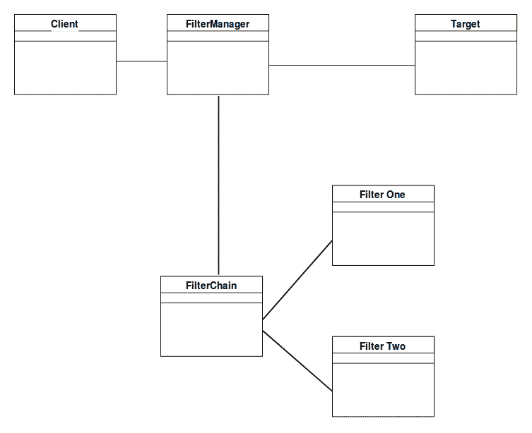

# 拦截过滤模式

> 原文:[https://www.geeksforgeeks.org/intercepting-filter-pattern/](https://www.geeksforgeeks.org/intercepting-filter-pattern/)

请求的预处理和后处理指的是在该请求的核心处理之前和之后采取的动作。这些动作中的一些决定了处理是否将继续，而其他动作将输入或输出的数据流处理成适合进一步处理的形式。

经典的解决方案由一系列条件检查组成，任何失败的检查都会中止请求。嵌套的 if/else 语句是一种标准策略，但这种解决方案会导致代码脆弱性和复制粘贴式的编程风格，因为过滤的流程和过滤器的动作都编译到应用程序中。
以灵活且不引人注意的方式解决这个问题的关键是拥有一个简单的添加和移除处理组件的机制，其中每个组件都完成一个特定的过滤动作。

**UML 图截取过滤模式**

[](https://media.geeksforgeeks.org/wp-content/uploads/Intercepting-Filter-Pattern1.png)

**设计组件**

*   **过滤器管理器:**过滤器管理器管理过滤器处理。它以正确的顺序创建带有适当过滤器的过滤器链，并启动处理。
*   **filter chain:**filter chain 是独立过滤器的有序集合。
*   **过滤器一、过滤器二:**这些是映射到目标的单个过滤器。过滤器链协调它们的处理。
*   **目标:**目标是客户端请求的资源。

**我们来看一个截取过滤模式的例子。**

```
// Java program to illustrate
// Intercepting Filter Pattern
import java.util.ArrayList;
import java.util.List;

interface Filter 
{
    public void execute(String request);
}

class AuthenticationFilter implements Filter 
{
    public void execute(String request)
    {
        System.out.println("Authenticating : " + request);
    }
}

class DebugFilter implements Filter 
{
    public void execute(String request)
    {
        System.out.println("Log: " + request);
    }
}

class Target 
{
    public void execute(String request)
    {
        System.out.println("Executing : " + request);
    }
}

class FilterChain 
{
    private List<Filter> filters = new ArrayList<Filter>();
    private Target target;

    public void addFilter(Filter filter)
    {
        filters.add(filter);
    }

    public void execute(String request)
    {
        for (Filter filter : filters) 
        {
            filter.execute(request);
        }
        target.execute(request);
    }

    public void setTarget(Target target)
    {
        this.target = target;
    }
}

class FilterManager 
{
    FilterChain filterChain;

   public FilterManager(Target target)
   {
       filterChain = new FilterChain();
        filterChain.setTarget(target);
   }
   public void setFilter(Filter filter)
   {
       filterChain.addFilter(filter);
   }

   public void filterRequest(String request)
   {
       filterChain.execute(request);
   }
}

class Client 
{
    FilterManager filterManager;

    public void setFilterManager(FilterManager filterManager)
    {
        this.filterManager = filterManager;

    }

    public void sendRequest(String request)
    {
        filterManager.filterRequest(request);
    }
}

class InterceptingFilter
{
    public static void main(String[] args) 
    {
        FilterManager filterManager = new FilterManager(new Target());
        filterManager.setFilter(new AuthenticationFilter());
        filterManager.setFilter(new DebugFilter());

        Client client = new Client();
        client.setFilterManager(filterManager);
        client.sendRequest("Downloads");

    }
}
```

输出:

```
Authenticating : Downloads
Log: Downloads
Executing : Downloads

```

**优势:**

*   **提高了可重用性:**公共代码集中在可插拔组件中，增强了重用性。
*   **增加灵活性:**可以声明方式应用和移除通用通用组件，提高灵活性。

**缺点:**

*   拦截模式下信息共享效率低。

本文由 **[Saket Kumar](https://github.com/saketkumar95)** 供稿。如果你喜欢 GeeksforGeeks 并想投稿，你也可以使用[contribute.geeksforgeeks.org](http://www.contribute.geeksforgeeks.org)写一篇文章或者把你的文章邮寄到 contribute@geeksforgeeks.org。看到你的文章出现在极客博客主页上，帮助其他极客。

如果你发现任何不正确的地方，或者你想分享更多关于上面讨论的话题的信息，请写评论。