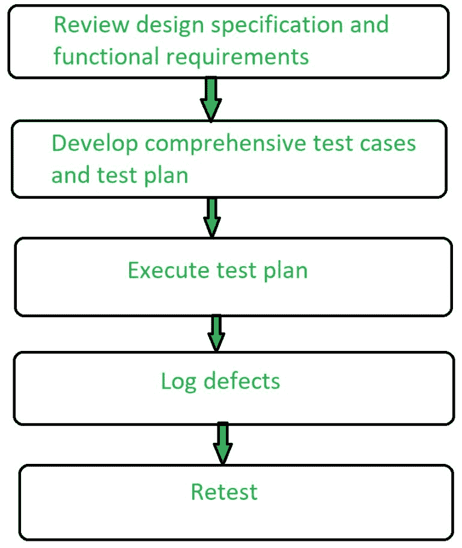

# 阿尔法测试|软件测试

> 原文:[https://www . geesforgeks . org/alpha-testing-software-testing/](https://www.geeksforgeeks.org/alpha-testing-software-testing/)

先决条件–[软件测试基础](https://www.geeksforgeeks.org/software-testing-basics/)、[软件测试类型](https://www.geeksforgeeks.org/types-software-testing/)
**阿尔法测试**是一种软件测试类型，用于在将产品发布给真实用户或公众之前识别缺陷。阿尔法测试是**用户验收测试**之一。

这之所以被称为阿尔法测试，只是因为它是在软件开发接近尾声的时候进行的。Alpha 测试通常由 homestead 软件工程师或质量保证人员执行。这是软件发布到现实世界之前的最后一个测试阶段。

**阿尔法测试的目的:**

1.  alpha 测试的目标是通过发现在之前的测试中没有发现的错误来改进软件产品。
2.  alpha 测试的目标是通过修复在之前的测试中没有发现的错误来改进软件产品。
3.  alpha 测试的目标是让客户深入到开发过程中。
4.  alpha 测试的目标是在开发的早期阶段更好地洞察软件的可靠性。

**阿尔法测试流程:**

1.  审查设计规范和功能要求。
2.  开发全面的测试用例和测试计划。
3.  执行测试计划
4.  日志缺陷
5.  问题解决后，重新测试

**阿尔法测试的阶段:**
阿尔法测试有两个阶段:

**第一阶段:**
第一阶段的测试由内部开发人员或软件工程师完成。他们要么使用硬件辅助调试器，要么使用调试器软件。目的是快速捕捉虫子。通常在 alpha 测试中，测试人员会遇到很多 bug、崩溃、缺少特性和文档。
**第二阶段:**
阿尔法测试的第二阶段由软件质量保证人员完成，用于环境中的附加测试。它包括黑盒测试和白盒测试。

**阿尔法测试的优势:**

*   更好地了解软件早期阶段的可靠性。
*   释放你的团队用于其他项目。
*   它缩短了交付市场的时间。
*   早期反馈有助于提高软件质量。