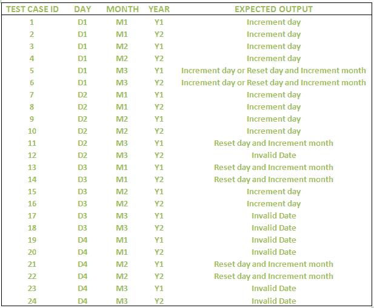

# 等价类测试-下一个日期问题

> 原文:[https://www . geesforgeks . org/等价类-测试-下一个日期-问题/](https://www.geeksforgeeks.org/equivalence-class-testing-next-date-problem/)

**等价类测试(等价类划分)**是软件测试中使用的黑盒测试技术，作为[软件开发生命周期(SDLC)](https://www.geeksforgeeks.org/what-is-sdlc-model-and-its-phases/) 的主要步骤。就时间消耗和测试用例的精确度而言，这种测试技术优于许多测试技术，如边界值分析、最坏情况测试、健壮情况测试等等。由于测试是为了识别可能的风险，等价类测试比其他技术表现得更好，因为使用它生成的测试用例在逻辑上是通过其间的分区来识别的，以创建不同的输入和输出类。这可以从下面陈述的下次日期问题中看出:

以日-月-年的形式给定一天，您需要为给定的日期找到下一个日期。为此执行边界值分析和等价类测试。

**条件:**

```
D:  1<Day<31
M:  1<Month<12
Y:  1800 <Year <2048 
```

**边界值分析:**

```
No. of test Cases (n = no. of variables) = 4n+1 = 4*3 +1 =13 
```

**测试用例:**

<center>

| 测试用例标识 | 一天 | 月 | 年 | 预期产出 |
| one |

</center>

onesixTwo thousand2-6-2000
TwoTwosixTwo thousand3-6-2000
threeFifteensixTwo thousand16-6-2000
fourThirtysix2000

1-7-2000
fiveThirty-onesixTwo thousand无效日期
sixFifteenoneTwo thousand16-1-2000
sevenFifteenTwoTwo thousand16-2-2000
eightFifteenElevenTwo thousand16-11-2000
nineFifteenTwelveTwo thousand16-12-2000
TenFifteensixOne thousand eight hundred16-6-1800
ElevenFifteensixOne thousand eight hundred and one16-6-1801
TwelveFifteensixTwo thousand and forty-seven16-6-2047
ThirteenFifteensixTwo thousand and forty-eight16-6-2048

**等价类测试:**

**输入类别:**

```
Day:
D1: day between 1 to 28
D2: 29
D3: 30 
D4: 31
Month:
M1: Month has 30 days
M2: Month has 31 days
M3: Month is February
Year:
Y1: Year is a leap year
Y2: Year is a normal year 
```

**输出类别:**

```
Increment Day
Reset Day and Increment Month
Increment Year
Invalid Date

```

**强正态等价类测试用例:**



**测试用例:**

<center>

| 测试用例标识 | 一天 | 月 | 年 | 预期产出 |
| E1 |

</center>

FifteenfourTwo thousand and four16-4-2004
E2FifteenfourTwo thousand and three16-4-2003
E3FifteenoneTwo thousand and four16-1-2004
E4FifteenoneTwo thousand and three16-1-2003
E5FifteenTwoTwo thousand and four16-2-2004
E6FifteenTwoTwo thousand and three16-2-2003
E7Twenty-ninefourTwo thousand and four30-4-2004
E8Twenty-ninefourTwo thousand and three30-4-2003
E9Twenty-nineoneTwo thousand and four30-1-2004
E10Twenty-nineoneTwo thousand and three30-1-2003
E11Twenty-nineTwoTwo thousand and four1-3-2004
E1229

TwoTwo thousand and three无效日期
E13ThirtyfourTwo thousand and four1-5-2004
E14ThirtyfourTwo thousand and three1-5-2003
E15ThirtyoneTwo thousand and four31-1-2004
E16ThirtyoneTwo thousand and three31-1-2003
E17ThirtyTwoTwo thousand and four无效日期
E18ThirtyTwoTwo thousand and three无效日期
E19Thirty-onefourTwo thousand and four无效日期
E20Thirty-onefourTwo thousand and three无效日期
E21Thirty-oneoneTwo thousand and four1-2-2004
E22Thirty-oneoneTwo thousand and three1-5-2003
E23Thirty-oneTwoTwo thousand and four无效日期
E24Thirty-oneTwoTwo thousand and threeInvalid Date

因此，从这个问题中可以清楚地看到，等价类测试清楚地检查了许多没有考虑边界值的情况，例如 2 月有 28-29 天，闰年导致 2 月的天数变化，等等。

因此，上面的例子证明了等价划分生成了更有效的测试用例，这些用例应该在风险评估中考虑。