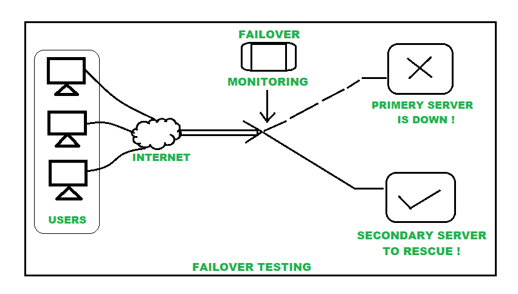

# 软件测试中的故障转移测试

> 原文:[https://www . geesforgeks . org/failover-testing-in-software-testing/](https://www.geeksforgeeks.org/failover-testing-in-software-testing/)

软件产品/服务在交付前经过多次测试，以确保它提供所需的服务。交付前的测试并不能保证将来不会出现问题。甚至有时软件应用程序由于一些不必要的事件、网络问题或与服务器相关的问题而失败。故障转移测试的目的是响应这些类型的故障。

假设 PC 因为一些技术问题下车，重启后我们打开浏览器，然后弹出一个窗口说*要恢复所有页面吗*？单击恢复时，所有选项卡都将恢复。确保此类恢复的过程称为故障转移测试。

**故障转移测试:**
故障转移测试是一种技术，用于验证当系统由于某种原因突然出现故障时，系统是否可以分配额外的资源并备份所有信息和操作。该测试确定系统处理关键故障和处理额外服务器的能力。因此，测试独立于服务器的物理硬件组件。

最好由服务器执行测试。**主动-主动**和**主动-被动**待机是最常见的两种配置。这两种技术以非常不同的方式实现故障转移，但它们都是为了提高服务器的可靠性而执行的。
*比如*，如果我们有三台服务器，其中一台因为负载过重而出现故障，然后出现两种情况。该故障服务器将自行重新启动，或者在故障服务器无法重新启动的情况下，其余服务器将处理负载。这种情况会在测试过程中进行测试。

**执行故障转移测试前的重要因素:**

1.  在考虑执行故障转移测试之前，首先要考虑的是预算。
2.  预算与可能在压力/负荷下崩溃或崩溃的框架有关。
3.  请始终记住，修复由系统故障引起的所有问题需要多长时间。
4.  记下最有可能的失败，并根据失败造成的伤害程度组织结果。

**执行故障转移测试时的重要因素:**

1.  保存一份测试后要采取的措施的计划。
2.  专注于测试计划的执行。
3.  建立一个基准，以便达到性能要求。
4.  准备一份关于问题要求和/或资产要求的报告。

**故障转移测试工作:**

故障转移测试

1.  在执行故障转移测试之前，请考虑预算、时间、团队、技术等因素。
2.  对故障转移原因进行分析并设计解决方案。
3.  开发测试用例来测试故障转移场景。
4.  根据结果执行测试计划。
5.  准备一份关于故障转移的详细报告。
6.  根据报告采取必要措施。

**故障转移测试的优势:**

1.  允许用户配置一切，如用户访问和网络设置等。
2.  确保所做的配置正常工作。
3.  所有的故障都很容易在系统的服务器上预先解决。
4.  提供更好的服务，以便用户的服务器能够平稳运行。
5.  确保停机期间无损失。

**故障转移测试示例:**

1.  银行和金融应用
2.  电信应用
3.  签证申请
4.  交易应用程序
5.  紧急服务业务应用
6.  政府申请
7.  国防服务相关应用

一旦识别出系统中的故障，问题就会得到解决，系统就会恢复到以前的状态。该测试的主要目的是确保在崩溃发生时及时保留数据和资源。