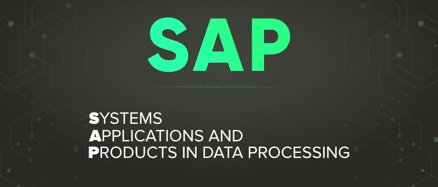

# SAP 完整表单

> 原文:[https://www.geeksforgeeks.org/sap-full-form/](https://www.geeksforgeeks.org/sap-full-form/)

**SAP** 代表**数据处理中的系统应用和产品。**一家德国软件程序公司，其项目允许企业智能跟踪客户端和业务。
思爱普，顾名思义，是企业资源规划软件的名称，也是公司的名称。

他们为管理贸易运作和客户关系制定计划安排。SAP 框架由许多完全协调的模块组成，涵盖了商业管理的各个方面。

#### 历史

SAP 是由韦伦路透、赫克托、霍普、普拉特纳和奇拉于 1972 年建立的。早期它被称为框架调查和程序开发(德语:system analysis and programmentikung)，之后被重新命名为 SAP。
1972 年——初级改编启动的时候。思爱普公司有 30 万美元的收入，有 9 名代表。

#### SAP 的特性

*   思爱普可能是一个基于客户端-服务器的软件，也称为 R/3。(其中“R”代表真实时间信息准备& 3 代表三层。
    *   数据库ˌ资料库
    *   应用服务器
    *   客户
*   **SAP 中包含的业务流程操作**如下:
    *   销售分配
    *   材料管理
    *   财务会计
    *   人力资本管理
    *   健康与安全
*   **SAP 由几个模块或阶段组成**，它们是:
    *   第 1 阶段——项目准备
    *   第 2 阶段–业务蓝图
    *   第 3 阶段——实现
    *   第 4 阶段——最终准备
    *   第 5 阶段–上线支持
*   所有应用程序都是基于 SAP 网络应用服务器的节拍构建的。扩展集被用来提供未使用的亮点，并保持中心尽可能稳定。网络应用服务器包含了思爱普基础的所有功能。

#### 优势

*   商业形式是标准化的。
*   支持与电子商务的集成。
*   规划、跟踪、计划和管理变得更加容易。
*   性价比高，因为它减少了权威开支。有助于企业的计算机化细节和检查
*   思爱普框架省却了复制数据。

#### 不足之处

*   对于一个小型组织来说，执行思爱普企业资源规划系统的成本很高。因此，购买和实施成本非常高。
*   SAP 框架持续复杂；以这种方式，一些组织可能不会改变同意它。
*   你必须成为合同专家来维护 SAP 框架。
*   商业上对模块间容量了解最少，但购买理由却很多。
*   在组织中制造内部冲突。