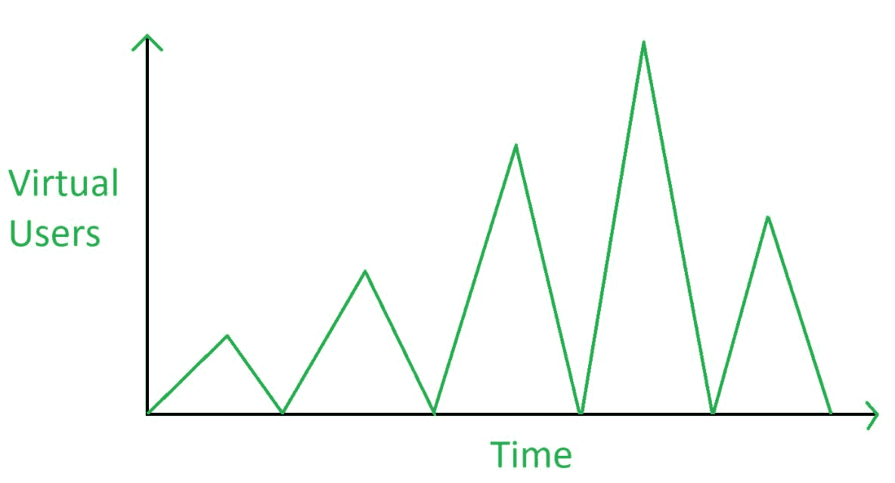

# 软件测试|尖峰测试

> 原文:[https://www . geesforgeks . org/software-testing-spike-testing/](https://www.geeksforgeeks.org/software-testing-spike-testing/)

**尖峰测试**是一种[软件性能测试](https://www.geeksforgeeks.org/performance-testing-software-testing/)，通过突然增加或减少系统或软件应用程序的负载来完成。负载是由大量用户产生的，并且系统的行为被观察到。尖峰测试的目标是确定系统在负载急剧变化的情况下是否会失败或幸存。

**刺突测试的目的:**T2【刺突测试的目的是:

*   评估系统或软件应用程序在突然变化的负载下的行为。
*   观察系统在突然变化的负载下的性能。
*   观察系统在极端负载下的故障。
*   确定两次峰值之间的恢复时间。

**尖峰测试流程:**

1.  **测试环境设置:**
    首先设置测试环境，进行成功的测试。它的建立是为了获得一个良好的质量测试过程。
2.  **确定极限负载:**
    设置好环境后，发现极限负载是一个系统所能抵抗的。极端负载是同时使用系统或软件应用程序的最大用户数。
3.  **将负载增加到峰值:**
    现在系统或软件应用的负载增加到峰值点。这一过程是突然进行的，即负载不是逐渐增加的。
4.  **峰值点分析:**
    在峰值点的载荷作用下，观察系统的行为。观察到系统是否在这种突然增加的负载下崩溃或存活。
5.  **将负荷降至零:**
    从极值点开始，负荷突然降至零或可能的最小负荷。该过程也是突然执行的，即负载突然从峰值降低到最小可能值。
6.  **最小负荷分析:**
    在最小可能负荷下观察系统行为。观察到系统是否在这种突然降低的负载下崩溃或存活。
7.  **性能图分析:**
    对突然增加和减少施加负载形成的系统性能图进行分析。观察形成什么样的穗就形成什么样的穗。

**尖峰测试图:**



**尖峰测试工具:**
所有的性能测试工具都可以用来执行尖峰测试，因为尖峰测试是一种性能测试，但是在尖峰测试中有一些常用的特定工具。常用的尖峰测试工具有:

```
1. Loadrunner
2. Apache Jmeter 
```

**尖峰测试的优势:**

1.  尖峰测试有助于将系统保持在极限负载下。
2.  尖峰测试可以避免系统或软件应用崩溃。
3.  它减少了系统或软件应用程序失败的机会。

**尖峰测试的缺点:**

1.  尖峰测试只需要专家来执行。
2.  尖峰测试的成本很高。