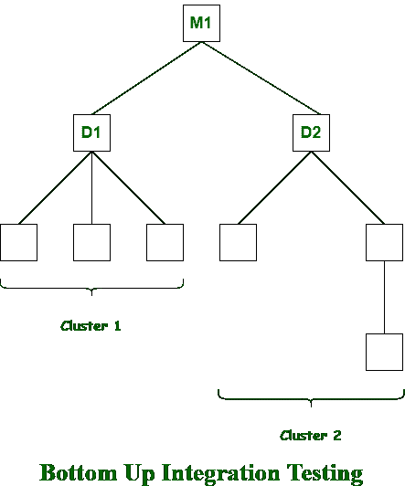

# 自下而上集成测试的步骤

> 原文:[https://www . geesforgeks . org/steps-in-bottom-up-integration-testing/](https://www.geeksforgeeks.org/steps-in-bottom-up-integration-testing/)

**自下而上测试**是一种增量式[集成测试](https://www.geeksforgeeks.org/software-engineering-integration-testing/)方法，通过架构结构的控制流，从下往上移动，集成或连接两个或多个模块来完成测试。在这些中，首先测试低级模块，然后测试高级模块。这种类型的测试或方法也被称为归纳推理，在许多情况下被用作综合同义词。自下而上的测试是用户友好的测试，并导致整体软件开发的增加。该测试的成功率高，结果持久。

**加工:**
以下是加工过程中需要遵循的步骤:

1.  集群是通过合并或组合低级模块或元素而形成的。这些集群也称为构建，负责执行软件的某些次要或辅助功能。
2.  编写测试控制程序很重要。这些控制程序也被称为驱动程序或高级模块。它只是协调测试用例的输入和输出。
3.  测试是对包含低级模块的整个构建或集群进行的。
4.  最后，在控制流的帮助下，控制程序或驱动程序或高级模块被移除，集群通过在程序结构中从下向上移动而被集成。

**示例–**
最后，模块或组件组合在一起形成集群 1 和集群 2。之后，在控制程序的帮助下测试每个集群。集群位于高级模块或驱动程序的下方。测试后，移除驱动程序，将集群与模块组合并向上移动。

**优势:**

*   创建和开发测试条件既简单又容易。
*   观察测试结果也很容易。
*   没有必要知道结构设计的细节。
*   低级实用程序也经过良好的测试，并且与面向对象的结构兼容。

**缺点:**

*   在层次结构的顶端，它变得非常复杂。
*   没有关于早期骨骼系统的概念。
*   由于变更，将对同级和更高级别的单元测试产生影响。